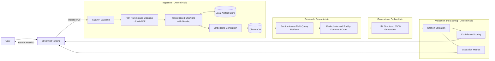

# PolicyExplainer Architecture

This document describes the end-to-end architecture of PolicyExplainer, a modular Retrieval-Augmented Generation (RAG) system for health insurance policy intelligence with strict grounding, citation enforcement, and evaluation-backed outputs.

PolicyExplainer is designed to prioritize reliability, traceability, and transparency over open-ended generation. All outputs are restricted to the uploaded document, and unsupported claims are filtered through deterministic validation.

---

# System Overview

PolicyExplainer is composed of two main layers:

- Frontend (Streamlit): user interface, workflow orchestration, and result presentation
- Backend (FastAPI): ingestion, retrieval, summarization, Q&A, citation validation, confidence scoring, and evaluation

Supporting components:

- ChromaDB: vector storage for chunk embeddings and retrieval
- Local artifact storage: persistent storage for uploaded files and generated processing artifacts
- OpenAI models: embeddings and structured generation

High-level responsibilities:

- Streamlit handles user actions such as upload, summary generation, evaluation display, Q&A, and export-oriented interactions
- FastAPI performs document processing and all RAG operations
- ChromaDB stores embeddings for semantic retrieval
- Local storage persists intermediate and final artifacts for reproducibility and auditing

---

# High-Level Data Flow



---

# Component Breakdown

## Frontend (Streamlit)

Primary responsibilities:

* Policy upload interface
* Summary and document insight views
* Policy Assistant chat interface
* Citation and page reference display
* Evaluation score display
* Session state management for the active document
* Triggering backend endpoints for ingestion, summarization, evaluation, and Q&A

Design principle:

Keep the frontend focused on user experience and workflow orchestration while centralizing all document intelligence logic in the backend.

---

## Backend (FastAPI)

The backend owns the core system logic. It is responsible for:

* Ingestion: parse PDF text, clean content, chunk deterministically, and persist artifacts
* Retrieval: semantic search with section-aware multi-query logic, deduplication, and document-order sorting
* Summarization: structured section-level policy summaries with citations
* Q&A: grounded answers backed by retrieved evidence
* Evaluation: scoring outputs on faithfulness, completeness, and simplicity
* Validation: filtering unsupported claims and invalid citations
* Confidence scoring: deriving reliability signals from retrieval and validation outputs

Core backend modules:

* `api.py`
* `ingestion.py`
* `retrieval.py`
* `summarization.py`
* `qa.py`
* `evaluation.py`
* `storage.py`
* `schemas.py`
* `utils.py`

---

# Ingestion Pipeline

The ingestion stage is deterministic and reproducible.

## 1. PDF Parsing

* Extract text page by page using PyMuPDF
* Clean headers, footers, and formatting noise
* Validate whether the uploaded document resembles a policy document using keyword heuristics
* Reject empty or unusable files

## 2. Chunking

* Split text into token-based chunks
* Use approximately 500 to 800 tokens per chunk
* Apply sliding overlap of around 80 tokens
* Preserve page association for citation grounding
* Generate deterministic chunk IDs:

```text
c_{page_number}_{chunk_index}
```

## 3. Persistence

Artifacts are stored per document for reproducibility:

```text
data/documents/{doc_id}/
├─ raw.pdf
├─ pages.json
├─ chunks.jsonl
├─ policy_summary.json
└─ evaluation_report.json
```

Vector database storage:

```text
./chroma_data
```

This design allows the system to trace outputs back to specific pages and chunks.

---

# Retrieval Layer

Retrieval uses section-aware multi-query logic instead of relying on a single embedding query.

For each canonical policy section, the system issues multiple semantic sub-queries to improve recall.

Example for Cost Summary:

* deductible
* copay
* coinsurance
* out-of-pocket maximum
* premium

Retrieval algorithm:

1. Run vector search for each sub-query
2. Merge all retrieved candidates
3. Deduplicate by `chunk_id`
4. Retain the strongest match where needed
5. Sort chunks by document order
6. Limit the context window before passing to the LLM

Benefits:

* Higher recall for sparse or distributed policy information
* Lower risk of missing relevant clauses
* Stable ordering of context
* Better citation grounding
* Reduced lost-in-the-middle effects

---

# Generation Layer

Generation is the only probabilistic component in the system.

The model is required to return structured JSON rather than unconstrained free-form output.

Generation tasks include:

* Section summaries
* Grounded document Q&A

Generation constraints:

* Use only retrieved document context
* Follow strict response schemas
* Attach citations to each supported answer unit
* Avoid unsupported claims
* Produce fallback output when evidence is insufficient

This design keeps generation bounded and easier to validate.

---

# Structured Summarization

PolicyExplainer generates section-based summaries using a strict schema.

Expected structure:

```json
{
  "section_name": "...",
  "present": true,
  "bullets": [
    {
      "text": "...",
      "citations": [
        { "page": 1, "chunk_id": "c_1_0" }
      ]
    }
  ]
}
```

Post-generation processing:

* Filter citations to only allowed retrieved chunk IDs
* Drop bullets with invalid or missing support
* Record validation issues
* Compute confidence signals

Unsupported content is not allowed in the final output.

---

# Grounded Question Answering

Users can ask natural-language questions about the uploaded policy.

Q&A pipeline:

1. Embed the user question
2. Retrieve top-k relevant chunks
3. Sort retrieved chunks in document order
4. Generate a structured answer
5. Validate citations
6. Remove unsupported claims
7. Compute confidence score

If the retrieved evidence is insufficient, the system returns:

```text
Not found in this document.
```

No external knowledge is used.

---

# Citation Validation

Citation validation is deterministic and mandatory.

Validation rules:

* Only allow citations from retrieved chunk IDs
* Verify chunk references are valid
* Normalize citation formatting
* Remove unsupported bullets or answer units
* Record validation warnings for downstream scoring

This layer acts as a guardrail between generation and presentation.

---

# Confidence Scoring

Confidence is derived from deterministic signals, such as:

* Citation validity
* Citation density
* Retrieval relevance strength
* Validation warnings
* Section coverage consistency

Confidence reflects how well the output is supported by the uploaded document. It is not a legal certainty score.

---

# Evaluation Framework

Evaluation is deterministic and runs after summary generation.

The system measures output quality across three independent dimensions.

## 1. Faithfulness (0.0 to 1.0)

Measures whether generated claims are supported by cited evidence.

Support logic may include:

* Token overlap checks
* Numeric consistency checks
* Citation validation against retrieved chunks

Higher score indicates stronger grounding.

---

## 2. Completeness (0.0 to 1.0)

Measures how well the summary covers canonical policy sections.

Example weights:

* Cost Summary (35%)
* Covered Services (30%)
* Administrative Conditions (15%)
* Exclusions and Limitations (10%)
* Plan Snapshot (5%)
* Claims and Appeals (5%)

Higher score indicates broader and more balanced coverage.

---

## 3. Simplicity (0.0 to 1.0)

Measures whether the generated summary is easier to understand than the original policy text.

Components:

* Readability improvement
* Jargon reduction
* Structural clarity

Example formulation:

```text
Simplicity Score =
0.4 * readability_improvement
+ 0.4 * jargon_reduction
+ 0.2 * structural_simplification
```

Higher score indicates clearer, simpler, and more user-friendly output.

---

# Deterministic vs Probabilistic Layers

## Deterministic

* PDF parsing and cleaning
* Chunking
* Retrieval ordering
* Deduplication
* Citation validation
* Confidence scoring
* Faithfulness scoring
* Completeness scoring
* Simplicity scoring
* Artifact persistence

## Probabilistic

* LLM-based summary generation
* LLM-based grounded Q&A generation

This separation reduces hallucination risk and increases auditability.

---

# Reproducibility and Traceability

Reproducibility is achieved through:

* Persisted raw uploaded documents
* Stored page-level extraction artifacts
* Deterministic chunk creation
* Persistent chunk IDs
* Stored vector index
* Saved summary artifacts
* Saved evaluation reports

Re-running ingestion on the same file should produce the same chunk structure and artifact layout, assuming the same preprocessing configuration.

---

# Storage Architecture

PolicyExplainer uses two complementary storage mechanisms.

## 1. Local Artifact Storage

Used for reproducibility and traceability:

* Raw uploaded PDF
* Parsed page text
* Chunked text artifacts
* Generated summary output
* Evaluation reports

## 2. Vector Storage (ChromaDB)

Used for semantic retrieval:

* Chunk embeddings
* Metadata associated with each chunk
* Retrieval-ready searchable index

This separation keeps the system both auditable and retrieval-efficient.

---

# Technology Stack

## Backend

* Python
* FastAPI
* Pydantic
* PyMuPDF
* ChromaDB
* OpenAI API

## Frontend

* Streamlit

## Storage

* Local JSON-based artifact persistence
* Persistent vector database

---

# Security and Deployment Considerations

Recommended production hardening includes:

* Restrict CORS origins
* Add authentication and authorization to backend endpoints
* Avoid logging sensitive policy content
* Store secrets only in environment variables
* Apply document retention and deletion policies
* Validate uploaded file types and size limits

---

# Summary

PolicyExplainer is an end-to-end RAG architecture engineered for reliable insurance policy understanding.

It emphasizes:

* Deterministic ingestion and retrieval
* Structured and bounded generation
* Strict citation enforcement
* Confidence-aware outputs
* Multi-axis evaluation using Faithfulness, Completeness, and Simplicity
* Artifact persistence for reproducibility and traceability

The architecture prioritizes grounded, measurable, and transparent outputs over open-ended generation.

---

*End of Architecture Document.*
