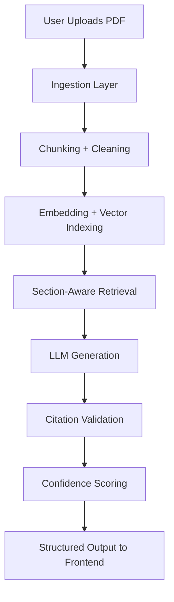

# PolicyExplainer Architecture

This document explains the full system design of PolicyExplainer, a modular Retrieval-Augmented Generation (RAG) system built for grounded insurance policy intelligence.

The architecture prioritizes:

- Deterministic preprocessing
- Strict citation enforcement
- Retrieval precision
- Evaluation-driven reliability
- Reproducibility

This is not a generic chatbot. It is a controlled document intelligence system designed for traceability and trust.

---

# System Overview

PolicyExplainer is composed of two decoupled layers:

| Layer | Technology | Responsibility |
|-------|------------|----------------|
| Frontend | Streamlit | UI, Chat Interface, Section Display, PDF Export |
| Backend | FastAPI | Ingestion, Retrieval, LLM Orchestration, Evaluation |

All document intelligence and validation logic reside in the backend.  
The frontend serves as an interaction and visualization layer.

---

# End-to-End Data Flow



---

# Core Pipeline Components

## 1. Ingestion Layer (Deterministic ETL)

File: `backend/ingestion.py`

### Responsibilities

- Generate UUID `doc_id`
- Extract page-level text via PyMuPDF
- Remove repeated headers and footers
- Validate likely insurance policy structure using keyword heuristics
- Chunk text into 500–800 token windows
- Apply sliding overlap (~80 tokens)
- Persist artifacts for reproducibility

Chunk ID format:

```text
c_{page_number}_{chunk_index}
```

### Why This Matters

- Page-preserving chunks ensure traceability.
- Deterministic chunking guarantees reproducibility.
- Overlap reduces semantic boundary loss.
- Stored artifacts allow post-hoc auditing.

This entire stage is deterministic.

---

## 2. Storage Layer (Dual-System Design)

File: `backend/storage.py`

### Local File Storage

```text
data/documents/{doc_id}/
├─ raw.pdf
├─ pages.json
├─ chunks.jsonl
└─ policy_summary.json
```

Purpose:

- Reproducibility
- Evaluation support
- Offline inspection
- Debug traceability

### Vector Storage (Chroma)

Each chunk is stored with metadata:

- doc_id
- page_number
- chunk_id

Vector database persistence path:

```text
./chroma_data
```

This allows multi-document isolation and consistent retrieval behavior.

---

## 3. Retrieval Layer (Precision-Oriented RAG)

File: `backend/retrieval.py`

### Section-Aware Multi-Query Retrieval

Instead of a single embedding query, each canonical section triggers multiple semantic sub-queries.

Example (Cost Summary):

- deductible
- copay
- coinsurance
- out-of-pocket maximum
- premium

### Retrieval Algorithm

1. Run vector search for each sub-query
2. Collect top-k results
3. Deduplicate by chunk_id
4. Keep lowest-distance match
5. Sort by `(page_number, chunk_id)`
6. Cap results to prevent context overload

### Why This Is Important

- Improves recall across terminology variations.
- Prevents “Lost-in-the-Middle” degradation.
- Preserves document narrative order.
- Reduces duplicate chunk injection.

These design decisions directly improve LLM output quality and reliability.

---

## 4. Summarization Layer (Structured Generation)

File: `backend/summarization.py`

### Forced JSON Contract

The LLM must return:

- `present` (boolean)
- `bullets[]`
  - `text`
  - `citations[]` (chunk_id + page)

### Citation Enforcement

Post-generation:

- Filter citations to allowed chunk_ids
- Drop bullets without valid citations
- Record validation issues
- Compute confidence score

This ensures that no unsupported claims reach the final output.

---

## 5. Q&A Layer (Grounded Answering)

File: `backend/qa.py`

### Routing Logic

Questions are classified into:

- Greeting
- Scenario-based query (e.g., emergency visit)
- Section deep-dive
- Standard RAG question

### Standard RAG Process

1. Retrieve top-k chunks
2. Sort in document order
3. Force structured JSON output
4. Filter citations
5. Remove unsupported claims
6. Compute confidence score

If no supporting chunks exist, the system returns exactly:

```text
Not found in this document.
```

No external knowledge is used.

---

# Evaluation Framework

File: `backend/evaluation.py`

Evaluation is deterministic and separate from generation.

Endpoint:

```text
POST /evaluate/{doc_id}
```

---

## Faithfulness (0.0 – 1.0)

Measures whether each summary bullet is supported by its cited chunk.

Support logic includes:

- Token overlap threshold
- Numeric consistency checks

This reduces hallucination risk and enforces grounding.

---

## Completeness (0.0 – 1.0)

Weighted coverage across canonical sections:

- Cost Summary (35%)
- Covered Services (30%)
- Administrative Conditions (15%)
- Exclusions & Limitations (10%)
- Plan Snapshot (5%)
- Claims & Appeals (5%)

Encourages balanced document coverage.

---

## Structural Validation

Checks include:

- Missing citations
- Invalid chunk references
- Inconsistent `present` flags
- Schema mismatch

---

# Deterministic vs Probabilistic Components

### Deterministic

- Chunking
- Retrieval ordering
- Deduplication logic
- Citation filtering
- Evaluation metrics
- Confidence scoring

### Probabilistic

- LLM outputs (temperature-based variation)

By isolating deterministic layers from probabilistic generation, the system maintains control, traceability, and reliability.

---

# Hallucination Mitigation Strategy

PolicyExplainer reduces hallucination risk through:

- Context-limited retrieval
- Strict JSON contract enforcement
- Post-generation citation validation
- Automatic removal of unsupported bullets
- Explicit “Not found” response requirement
- Deterministic evaluation checks

This layered guardrail approach improves trustworthiness.

---

# Backend Module Layout

```text
backend/
├─ api.py             → FastAPI endpoints
├─ ingestion.py       → PDF parsing & chunking
├─ retrieval.py       → Section-aware retrieval logic
├─ summarization.py   → Structured summary generation
├─ qa.py              → Question routing & RAG answering
├─ evaluation.py      → Faithfulness & completeness scoring
├─ storage.py         → File + Chroma persistence
├─ schemas.py         → Pydantic contracts
└─ utils.py           → Helper utilities
```

---

End of Architecture Document.
